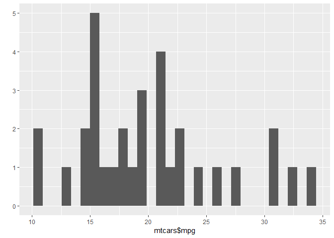

<!-- README.md is generated from README.Rmd. Please edit that file -->

# mod::ule

<!-- badges: start -->

[](https://ci.appveyor.com/project/iqis/mod)
[](https://travis-ci.org/iqis/mod)
[](https://codecov.io/gh/iqis/mod)
[](https://www.tidyverse.org/lifecycle/#maturing)
[](https://cran.r-project.org/package=mod)


<!-- badges: end -->

The `mod` package is a lightweight module system; It provides a simple
way to structure program and data into modules for programming and
interactive use, without the formalities of R packages.

## Why?

This is a good question.

As units for code organization in R, packages are very robust. However,
they are formal and compliated; they require additional knowledge to R
and must be installed in the local library. Scripts, as widely
understood, are simplistic and brittle, unsuitable for building tools
and may conflict with each other.

Situated between packages and scripts, modules feature characteristics
that are somewhat similar to those from other languages. They can be
defined either inline with other codes or in a standalone file, and can
be used in the user’s working environment, packages, or other modules.

Let’s see.

## Installation

Install the development version from [GitHub](https://github.com/) with:

``` r
devtools::install_github("iqis/mod")
```

## Use

The `mod` package is designed to be used either attached or unattached
to your working environment.

If you wish to attach the package:

``` r
require(mod)
#> Loading required package: mod
#> 
#> Attaching package: 'mod'
#> The following object is masked from 'package:base':
#> 
#>     drop
```

## Vocabulary

  - Make a module:
      - Inline:`module()`/`mod::ule()`
      - From a file: `acquire()`
  - The search path:
      - Attach a module to: `use()`
      - Detach a module from: `drop()`
  - Inside a module:
      - Declare public variables within the module: `provide()`
      - Attach a package locally: `require()`
      - Import variables from another module: `refer()`

## Examples

Define an inline module:

``` r
my <- module({
        a <- 1
        b <- 2
        f <- function(x, y) x + y
})
```

The resulting module contains the variables defined within.

``` r
ls(my)
#> [1] "a" "b" "f"
```

Subset the module.

``` r
my$a
#> [1] 1
my$b
#> [1] 2
my$f(my$a, my$b)
#> [1] 3
```

Use the `with()` to spare qualification.

``` r
with(my, 
     f(a,b))
#> [1] 3
```

### Attach a Module to the Search Path

Just like a package, a module can be attached to the search path.

``` r
use(my)
```

The `my` module is attached to the search path as “module:my”, before
other attached packages.

``` r
search()
#>  [1] ".GlobalEnv"        "module:my"         "package:mod"      
#>  [4] "package:stats"     "package:graphics"  "package:grDevices"
#>  [7] "package:utils"     "package:datasets"  "package:methods"  
#> [10] "Autoloads"         "package:base"
```

And you can use the variables inside directly, just like those from a
package.

``` r
f(a,b)
#> [1] 3
```

Detach the module from the search path when done, if desired.

``` r
drop("my")
```

### Make Variables Available to another Module

Use `refer()` to “import” variables from another module.

``` r
ls(my)
#> [1] "a" "b" "f"

my_other<- module({
        refer(my)
        
        c <- 4
        d <- 5
})

ls(my_other)
#> [1] "a" "b" "c" "d" "f"
```

### Use a package

The `mod::require()` makes packages available for use in a module.

``` r
mpg_analysis <- module({
    require(ggplot2)
    plot <- qplot(mtcars$mpg)    
})
#> Registered S3 methods overwritten by 'ggplot2':
#>   method         from 
#>   [.quosures     rlang
#>   c.quosures     rlang
#>   print.quosures rlang
mpg_analysis$plot
#> `stat_bin()` using `bins = 30`. Pick better value with `binwidth`.
```



Meanwhile, your working environment’s search path remain unaffected:

``` r
search()
#>  [1] ".GlobalEnv"        "package:mod"       "package:stats"    
#>  [4] "package:graphics"  "package:grDevices" "package:utils"    
#>  [7] "package:datasets"  "package:methods"   "Autoloads"        
#> [10] "package:base"
```

``` r
"package:ggplot2" %in% search()
#> [1] FALSE
```

### Private Variables

A variable is *private* if its name starts with `..`.

``` r
room_101 <- module({
        ..diary <- "Dear Diary: I used SPSS today..."
        get_diary <- function(){
                ..diary
        }
})
```

A private variable cannot be seen or touched. There is no way to access
the `..diary` from the outside, except by a function defined within the
module. This can be useful if you want to shield some information from
the user or other programs.

``` r
ls(room_101)
#> [1] "get_diary"
room_101$..diary
#> NULL
room_101$get_diary()
#> [1] "Dear Diary: I used SPSS today..."
```

Another way is using `provide()` function to declair public variables,
while all others become private.

``` r
room_102 <- module({
        provide(open_info, get_classified)
        
        open_info <- "I am a data scientist."
        classified_info <- "I can't get the database driver to work."
        get_classified <- function(){
                classified_info
        }
})

ls(room_102)
#> [1] "get_classified" "open_info"
room_102$open_info
#> [1] "I am a data scientist."
room_102$classified_info
#> NULL
room_102$get_classified()
#> [1] "I can't get the database driver to work."
```

### Simlate OOP

The below example simulates one essential behavior of an object in
Object-oriented Programming by manipulating the state of `..count`.

``` r
counter <- module({
        ..count <- 0
        add_one <- function(){
                #Its necessary to use `<<-` operator, as ..count lives in the parent frame.
                ..count <<- ..count + 1 
        }
        reset <- function(){
                ..count <<- 0
        }
        get_count <- function(){
                ..count
        }
})
```

A variable must be private to be mutable like `..count`.

The following demonstration should be self-explanatory:

``` r
counter$get_count() 
#> [1] 0

counter$add_one() 
counter$add_one() 

counter$get_count() 
#> [1] 2

counter$reset()

counter$get_count()
#> [1] 0
```

It is imperative that `mod` be only adopted in the simplest cases. If
full-featured OOP is desired, use
[`R6`](https://CRAN.R-project.org/package=R6).

## Notes

#### Environment

A module *is* an environment. This means that every rule that applies to
environments, such as copy-by-reference, applies to modules as well.

``` r
mode(my)
#> [1] "environment"
is.environment(my)
#> [1] TRUE
```

#### Terms

Some may wonder the choice of terms. Why `refer()` and `provide()`?
Further, why not `import()` and `export()`? This is because we feel
`import()` and `export()` are used too commonly, in both R, and other
popular languages with varying meanings. The `reticulate` package also
uses `import()`. To avoid confusion, we decided to introduce some
synonyms. With analogous semantics,
[`refer()`](https://clojuredocs.org/clojure.core/refer) is borrowed from
Clojure, while
[`provide()`](https://docs.racket-lang.org/reference/require.html?q=provide#%28form._%28%28lib._racket%2Fprivate%2Fbase..rkt%29._provide%29%29)
from Racket; Both languages are R’s close relatives.

#### Locked

It is impossible to either change the value of a variable or add a new
variable to a module. A private variable’s value can only be changed by
a function defined within the module, as shown previously.

``` r
my$a <- 888
#> Error in my$a <- 888: cannot change value of locked binding for 'a'
my$c <- 666
#> Error in my$c <- 666: cannot add bindings to a locked environment
```

#### Hidden Variables

As a general R rule, names that start with `.` define hidden variables.

``` r
my_yet_another <- module({
        .var <- "I'm hidden!"
})
```

Hidden variables are not returned by `ls()`, unless specified.

``` r
ls(my_yet_another)
#> character(0)
ls(my_yet_another, all.names = TRUE)
#> [1] ".var"
```

Nonetheless, in a module, they are treated the same as public variables.

``` r
my_yet_another$.var
#> [1] "I'm hidden!"
```

#### Load/Attach from File

``` r
module_path <- system.file("misc/example_module.R", package = "mod")
```

To load and assign to variable:

``` r
example_module <- acquire(module_path)
ls(example_module)
#> [1] "a" "d" "e"
example_module$a
#> [1] 1
example_module$d()
#> [1] 6
example_module$e(100)
#> [1] 106
```

To load and attach to search path:

``` r
use(module_path)
ls("module:example_module")
#> [1] "a" "d" "e"
a
#> [1] 1
d()
#> [1] 6
e(100)
#> [1] 106
```

#### Modules and Packages

It *could* be confusing how modules and packages live together. To
clarify:

  - Attach a Package
      - Everywhere: `require()`
  - Attach a Module
      - To another module: not available
      - To the global search path: `use()`
  - Copy Variables from a Module
      - To another module: `refer()`
      - To the working directory: not available
  - Use Modules inside a Package
      - Yes, the package must `Depends` on `mod` package

#### Unattached

As aforementioned, the package is designed to be usable both attached
and unattached.

If you use the package unattached, you must always qualify the variable
name with `::`, such as `mod::ule()`, a shorthand for `mod::module()`.
However, while inside a module, the `mod` package is always available,
so you do not need to use `::`. Note that in the following example,
`provide()` inside the module expression is unqualified.

See:

``` r
detach("package:mod")

my_mind <- mod::ule({
  provide(good_thought)
  good_thought <- "I love working on this package!"
  bad_thought <- "I worry that no one will appreciate it."
})

mod::use(my_mind)
good_thought
#> [1] "I love working on this package!"
```
