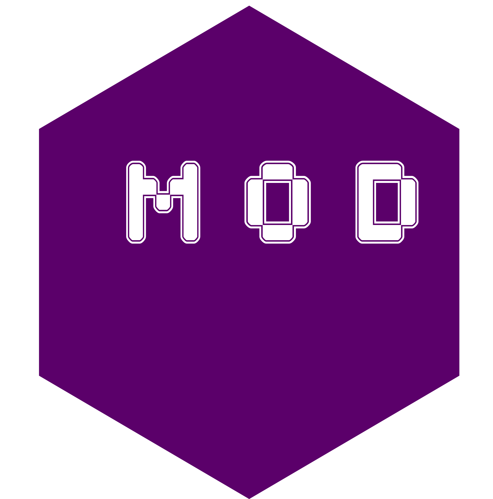
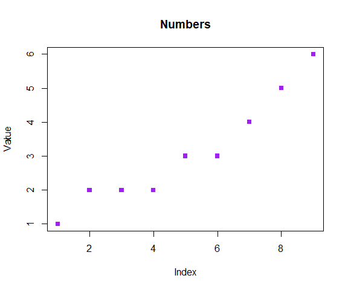

<!-- README.md is generated from README.Rmd. Please edit that file -->

# mod::ule 

<!-- badges: start -->

[](https://ci.appveyor.com/project/iqis/mod)
[](https://travis-ci.org/iqis/mod)
[](https://codecov.io/gh/iqis/mod)
[](https://cran.r-project.org/package=mod)
[](https://cran.r-project.org/web/licenses/GPL-3)
[](https://www.tidyverse.org/lifecycle/#maturing)
<!-- badges: end -->

The `mod` package provides a simple and friendly way to structure
program and data into flexible and independent units for programming and
interactive use. Modules indtroduced by the `mod` package offer merits
and conveniences currently absent from R.

## Why?

Programs need to be oraganized into units.

A package is a very robust solution, but is formal and compliated;
packages require additional knowledge to R and must be installed in the
local library by `install.packages()`; it is not easy to manage
different versions of the same package. On the other hand, simple R
scripts, often executed by `source()`, are brittle and may create
namespace conflict; They are unsuitable for building tools and
applications.

Modules fills the hollow middleground by allowing programs to live
separately and work together at the same time. Each module has its own
scope, host is own objects, an can each use different packages without
interefering with each other or the user’s global search path. They can
be created either inline along other programs or from a standalone file,
and can be used in the user’s working environment, as a part of a
package, or in other modules.

## Installation

Install the published version from
[CRAN](https://CRAN.R-project.org/package=mod) with:

``` r
install.packages("mod")
```

Install the development version from [GitHub](https://github.com/) with:

``` r
devtools::install_github("iqis/mod")
```

## Vocabulary

The `mod` package has a simple UI:

  - Make a module:
      - Inline:`module()`/`mod::ule()`
      - From a file: `source_module()`
  - The search path:
      - Attach a module: `use()`
      - Detach a module: `drop()`
  - Inside a module:
      - Declare public objects: `provide()`
      - Attach a package locally: `require()`
      - Copy objects from another module: `refer()`
      - Name the module: `name()`

## Quickstart

``` r

my_numbers <- mod::ule({
        numbers <- c(1,2,2,2,3,3,4,5,6)
})

my_plot <- mod::ule({
        refer(my_numbers)
        numbers_plot <- function(x = numbers) {
                plot(x, col = "purple", pch = 15)
                title("Numbers", ylab = "Value")
        }
})

my_numbers$numbers
#> [1] 1 2 2 2 3 3 4 5 6
my_plot$numbers_plot()
```



## Documentation

`mod` [website](https://iqis.github.io/mod)

  - [Introduction to
    Modules](https://iqis.github.io/mod/articles/introduction.html)
